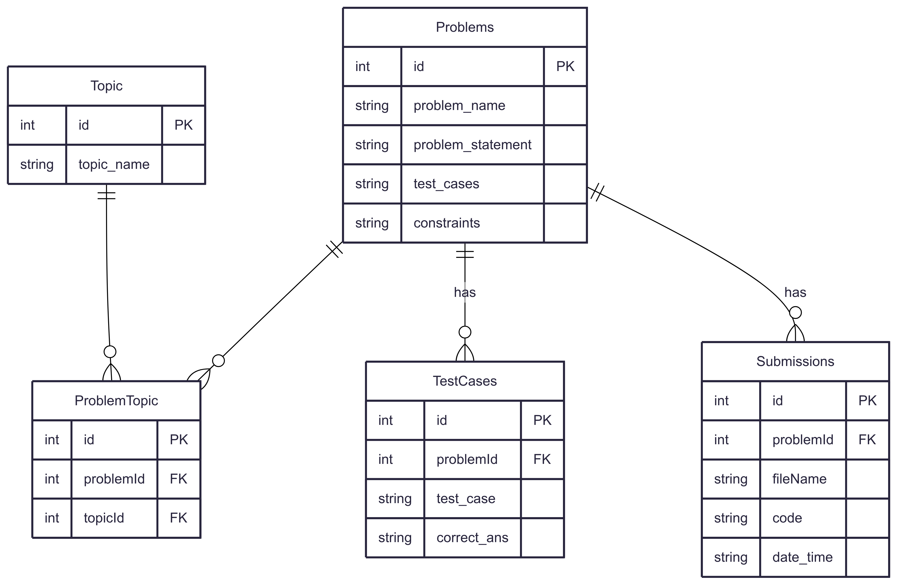

# DESIGN

## Introduction

This document outlines the database design for the `local_dsa` Python package. The database stores and manages data related to coding problems, including metadata, topics, test cases, and user submissions. This supports key functionalities such as problem retrieval, automatic comment injection, similarity-based suggestions, and solution testing/storage.

---

## Purpose

The database serves as the backbone of the `local_dsa` system, enabling:

- Structured storage of coding problems.
- Association of problems with multiple topics.
- Storage of detailed test cases for automated testing.
- Storing user submissions for future reference.
- Efficient querying for related problems and suggestions.

---

## Scope

The system focuses on:

- Competitive programming and interview preparation.
- Local, offline-first access to problems and solutions.
- Efficient storage of metadata, test cases, and code submissions.
- Dynamic support for adding new problems, topics, and submissions.

---

## Entities and Attributes

### 1. **Problems**
- `id` (PK): Unique identifier for the problem.
- `problem_name`: Title of the problem.
- `problem_statement`: Full description.
- `test_cases`: (Optional) Serialized test case data.
- `constraints`: Problem constraints (e.g., input limits).

### 2. **Topic**
- `id` (PK): Unique identifier.
- `topic_name`: Name of the topic (e.g., "Dynamic Programming").

### 3. **ProblemTopic**
- `id` (PK): Surrogate key.
- `problemId` (FK): Links to Problems.
- `topicId` (FK): Links to Topic.
- Acts as a **many-to-many relationship** table between Problems and Topics.

### 4. **TestCases**
- `id` (PK): Unique identifier.
- `problemId` (FK): Related problem.
- `test_case`: Raw input string.
- `correct_ans`: Expected output.

### 5. **Submissions**
- `id` (PK): Unique identifier.
- `problemId` (FK): Related problem.
- `fileName`: Name of the submitted file.
- `code`: User-submitted code.
- `date_time`: Submission timestamp.

---

## Relationships

- **Problems ↔ Topics**: Many-to-many via `ProblemTopic`.
- **Problems ↔ TestCases**: One-to-many.
- **Problems ↔ Submissions**: One-to-many.

This structure allows:
- Problems to be categorized under multiple topics.
- Each problem to have multiple test cases.
- Each problem to have multiple submissions tracked over time.

---

## Optimizations

- **Foreign Keys**: Enforced referential integrity.
- **Indexing**: Can be applied on `problemId` in `Submissions` and `TestCases` for faster joins.
- **Decomposition**: Reduces data redundancy (e.g., through `ProblemTopic` table).
- **Scalability**: Supports dynamic growth of problems, topics, and submissions.

---

## Limitations

- **No user tracking**: Currently, no support for user accounts or identity—submissions are not user-specific.
- **No submission grading**: The system assumes correctness is verified by `test_problem()` externally.
- **Redundant `test_cases` in Problems**: The `test_cases` field is partially redundant with the `TestCases` table.
- **No language/runtime support**: Assumes Python-only, lacks multi-language or execution sandbox metadata.

---

## Future Improvements

- Add a **Users** table to enable personalized submission tracking.
- Normalize `test_cases` fully and remove the raw string from `Problems`.
- Introduce difficulty levels, tags, and company-based filters.
- Add a `status` field in Submissions (e.g., passed/failed).

---

## ER Diagram

(Refer to the attached ER diagram image)

